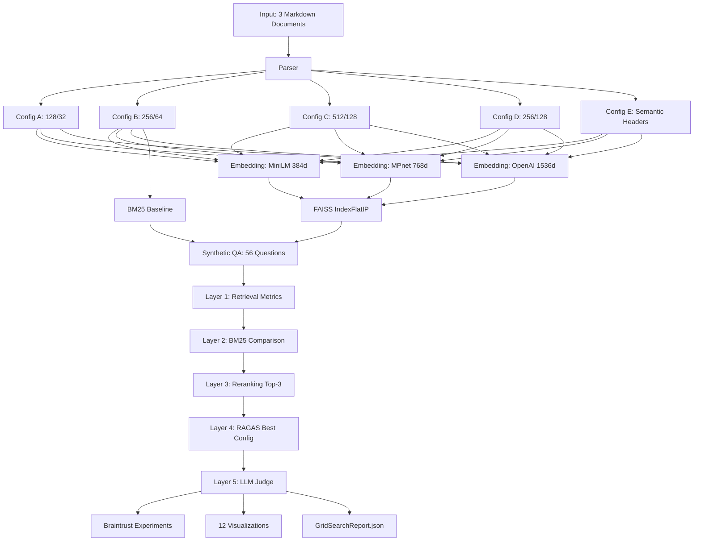

# P2: RAG Evaluation Benchmarking Framework

> Systematic grid search across 16 RAG configurations — 5 chunking strategies × 3 embedding models + BM25 baseline — evaluated through 5 layers of metrics to find the optimal setup for any document.


<p align="center">
  
</p>

## Key Results

Evaluated **16 configurations** across 5 evaluation layers (retrieval metrics, BM25 baseline, Cohere reranking, RAGAS generation quality, LLM-as-Judge). The framework tested chunk sizes from 128 to 512 tokens, 25% vs 50% overlap, semantic vs fixed-size chunking, and 3 embedding models.

### Winner: `E-openai` (Semantic Chunking + OpenAI Embeddings)

| Metric | Before Reranking | After Reranking | Improvement |
|--------|------------------|-----------------|-------------|
| **Recall@5** | 0.625 | 0.747 | +19.5% |
| **Precision@5** | 0.346 | 0.457 | +32.1% |
| **MRR@5** | 0.533 | 0.638 | +19.7% |

**Why it won:** Structure-aware chunking preserves document semantics better than fixed-size windows. Sections split at natural header boundaries maintain context coherence.

### Experiment Findings

| Experiment | Finding | Data |
|-----------|---------|------|
| **Chunk Size** | 256 tokens is the sweet spot — 128 too granular, 512 too coarse | 256t: 0.607 R@5 vs 512t: 0.512 R@5 (−15.7%) |
| **Overlap** | More overlap ≠ better — 50% underperforms 25% | 25%: 0.607 R@5 vs 50%: 0.529 R@5 (−13%) |
| **Embeddings** | OpenAI beats local models by 26% — training data quality > dimensionality | OpenAI 1536d: 0.607 vs MiniLM 384d: 0.481 |
| **Semantic vs Fixed** | Structure-aware chunking outperforms all fixed-size configs | Config E: 0.625 R@5 vs Config B: 0.607 R@5 (+3%) |
| **BM25 Baseline** | Semantic search wins by 64% over lexical | BM25: 0.381 vs E-openai: 0.625 |
| **Reranking** | ~20% average lift for negligible cost ($0.05/168 reranks) | E-openai: 0.625 → 0.747 R@5 (+19.5%) |
| **RAGAS** | 51% faithfulness, 73% context precision — retrieval strong, generation needs work | Faithfulness: 0.511, Context Precision: 0.734 |
| **Judge Calibration** | 73% hallucination rate inflated by refusals counted as hallucinations | 22/41 "hallucinations" were actually "I don't have enough context" refusals |

## Why This Matters

Most RAG tutorials use a single chunk size and embedding model, then declare victory. Production systems need evidence-based configuration. This framework provides the methodology: define your configuration space, generate targeted evaluation data, measure across multiple layers, and let the data pick the winner. The 16-config grid search pattern generalizes to any document type — swap the input PDF and re-run.

## Architecture



**Execution flow:** Parse documents → Chunk (5 strategies) → Embed (3 models) → Index (FAISS) → Generate QA (56 questions) → Evaluate retrieval (16 configs) → Compare BM25 → Rerank top-3 (Cohere) → Evaluate generation (RAGAS) → Judge quality → Log to Braintrust

## Engineering Practices

- **5 Architecture Decision Records** — FAISS selection, chunking strategy design, embedding model comparison, QA generation strategies, semantic vs fixed-size results analysis
- **557 tests** — schema validation, chunker correctness, embedding shape verification, retrieval metric computation
- **Braintrust experiment tracking** — every configuration logged with inputs, outputs, scores, and feedback classification
- **369-file LLM cache** — MD5-keyed JSON cache eliminates redundant API calls across development iterations
- **CLI with Rich output** — `report`, `compare`, and `run` commands for developer-friendly pipeline interaction
- **Pydantic v2 throughout** — `ConfigEvaluation`, `RAGASResult`, `JudgeResult`, `GridSearchReport` — every data structure validated at runtime

## Evaluation Deep Dive

### Configuration × Metric Heatmap

<p align="center">
  
</p>

The heatmap reveals that embedding model choice has a larger impact than chunk size — OpenAI embeddings consistently outperform local models regardless of chunking strategy.

### Reranking Impact

<p align="center">
  
</p>

Cohere cross-encoder reranking delivered 10-27% improvement across all tested configurations. Config D (50% overlap) saw the largest lift — reranking effectively compensates for the redundancy problem that high overlap creates.

### Embedding Model Comparison

<p align="center">
  
</p>

OpenAI text-embedding-3-small (1536d) outperforms both local models by 26%. Training data quality matters more than dimensionality — MPnet (768d) performs no better than MiniLM (384d).

## Architecture Decisions

| ADR | Decision | Key Insight |
|-----|----------|-------------|
| [ADR-001](docs/adr/ADR-001-faiss-over-chromadb-lancedb.md) | FAISS over ChromaDB/LanceDB | Brute-force exact search for <1K vectors — benchmarking needs deterministic results |
| [ADR-002](docs/adr/ADR-002-chunk-size-overlap-semantic.md) | 5-config experimental design | Isolate chunk size, overlap, and semantic variables independently |
| [ADR-003](docs/adr/ADR-003-embedding-model-comparison.md) | Local + API embedding models | ThreadPoolExecutor parallelization for API; sequential for RAM-safe local |
| [ADR-004](docs/adr/ADR-004-synthetic-qa-generation-strategies.md) | 5 QA generation strategies | Diverse question types ensure evaluation isn't biased toward one retrieval pattern |
| [ADR-005](docs/adr/ADR-005-semantic-vs-fixed-chunking-results.md) | Semantic vs fixed-size results | Structure-aware chunking wins for structured documents; fixed-size better for unstructured |

## Tech Stack

**Retrieval:** FAISS IndexFlatIP · BM25 (rank-bm25) · Cohere Rerank API
**Embeddings:** sentence-transformers (MiniLM, MPnet) · LiteLLM (OpenAI text-embedding-3-small)
**Chunking:** langchain-text-splitters · Custom Markdown header splitter
**Evaluation:** RAGAS · judges library · Braintrust experiment tracking
**Generation:** OpenAI GPT-4o-mini · Instructor (structured QA generation)
**Visualization:** Matplotlib · Seaborn · Plotly (Streamlit interactive)
**Demo:** Streamlit (7-page dashboard) · Click CLI with Rich output

## Quick Start

```bash
cd 02-rag-evaluation
uv sync
cp .env.example .env  # Add OPENAI_API_KEY, COHERE_API_KEY, BRAINTRUST_API_KEY

# Run full evaluation pipeline (~15 min, cached re-runs much faster)
python -m src.grid_search

# Generate all 12 visualizations
python -c "from src.visualization import generate_all_charts; generate_all_charts()"

# CLI reporting
python -m src.cli report              # Rich-formatted results table
python -m src.cli compare E-openai B-openai  # Side-by-side comparison

# Launch Streamlit demo
uv run streamlit run streamlit_app.py
```

> **Required API keys:** `OPENAI_API_KEY` (embeddings + generation), `COHERE_API_KEY` (reranking, free tier sufficient), `BRAINTRUST_API_KEY` (experiment tracking)

## Project Structure

```
02-rag-evaluation/
├── README.md                          # THIS FILE
├── CLAUDE.md                          # Claude Code session context
├── PRD.md                             # Implementation contract
├── pyproject.toml                     # Dependencies (uv)
├── src/
│   ├── config.py                      # 5 chunk configs, 3 embedding models, paths
│   ├── models.py                      # Pydantic schemas (ConfigEvaluation, RAGASResult, etc.)
│   ├── parser.py                      # PDF (PyMuPDF) + Markdown parser
│   ├── chunker.py                     # Fixed-size (A-D) + semantic (E) chunkers
│   ├── embedder.py                    # SentenceTransformers (local) + LiteLLM (API)
│   ├── vector_store.py                # FAISS IndexFlatIP wrapper
│   ├── bm25_baseline.py               # BM25Okapi retrieval
│   ├── synthetic_qa.py                # 5 QA strategies via Instructor
│   ├── retrieval_evaluator.py         # Recall/Precision/MRR @K
│   ├── reranker.py                    # Cohere Rerank integration
│   ├── generation_evaluator.py        # RAGAS wrapper
│   ├── judge.py                       # LLM-as-Judge + Bloom classifier
│   ├── braintrust_logger.py           # Experiment tracking
│   ├── grid_search.py                 # Orchestrator — runs full pipeline
│   └── visualization.py               # 12 chart generation functions
├── data/
│   ├── input/                         # 3 Kaggle Markdown documents
│   ├── cache/                         # LLM response cache (369 files)
│   └── output/                        # Chunks, QA pairs, FAISS indices
├── results/
│   ├── charts/                        # 12 PNG visualizations
│   ├── metrics/                       # JSON result files
│   └── reports/                       # GridSearchReport + QADatasetReport
├── docs/
│   └── adr/                           # 5 Architecture Decision Records
├── streamlit_app.py                   # Interactive demo (7 pages)
└── tests/                             # pytest test suite (557 tests)
```

## Key Insights

1. **Semantic chunking outperforms fixed-size for structured documents** — Config E beat all fixed-size configs by 3-22% on Recall@5. For documents with clear structure (reports, manuals, wikis), preserve section boundaries instead of splitting mid-paragraph.

2. **Overlap is overrated** — 50% overlap underperformed 25% by 13%. Redundancy dilutes ranking quality. Use minimal overlap (10-25%) — just enough to prevent boundary fragmentation.

3. **Reranking is non-negotiable for production** — ~20% average improvement for $0.05 per 168 reranks. Always implement 2-stage retrieval: fast vector search (top-20) → accurate cross-encoder reranking (top-5).

4. **Embedding training data quality > model size** — OpenAI 1536d beat local 768d by 26%. Supervised training data (OpenAI's massive labeled dataset) trumps raw dimensionality.

5. **Judge calibration is critical** — LLM-as-Judge flagged 73% hallucination rate, but 22/41 were refusals ("I don't have enough context") — a prompt calibration issue, not actual hallucinations. Always manually sample judge verdicts.

6. **Production would need hybrid retrieval** — BM25 + vector search ensemble (Reciprocal Rank Fusion) beats either alone. This framework identifies the best single-method config; real systems should combine them.

---

**Part of [AI Portfolio Sprint](../README.md)** — 9 projects in 8 weeks demonstrating production AI/ML engineering.

Built by **Ruby Jha** · [LinkedIn](https://linkedin.com/in/jharuby) · [GitHub](https://github.com/rubsj/ai-portfolio)
