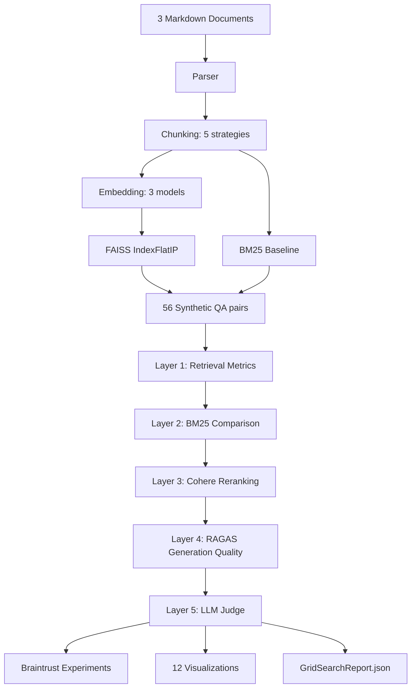

# P2: RAG Evaluation Benchmarking Framework

I tested 16 RAG configurations and found that semantic chunking + OpenAI embeddings + Cohere reranking gets 0.747 Recall@5 on structured Markdown docs. This is how I got there.

Part of a 9-project portfolio built in 8 weeks. 5 ADRs, 557 tests, 12 evaluation charts.


**Live Dashboard:** Deploying in Week 8 of the portfolio sprint. Link will be added here.

<p align="center">
  
</p>

## Results

Best config: **E-openai** (semantic chunking by Markdown headers + OpenAI text-embedding-3-small).

| Metric | Before Reranking | After Reranking | Improvement |
|--------|------------------|-----------------|-------------|
| **Recall@5** | 0.625 | 0.747 | +19.5% |
| **Precision@5** | 0.346 | 0.457 | +32.1% |
| **MRR@5** | 0.533 | 0.638 | +19.7% |

Semantic chunking splits at header boundaries, so each chunk maps to a coherent section instead of cutting mid-paragraph. That alone beat every fixed-size config by 3-22% on Recall@5.

## Findings

Evaluated on 3 Kaggle Markdown documents (technical reports, ~15K tokens total).

| Experiment | Result | Data |
|-----------|--------|------|
| Chunk Size | 256 tokens best. 128 too granular, 512 too coarse. | 256t: 0.607 R@5 vs 512t: 0.512 R@5 |
| Overlap | 50% overlap hurt ranking. 25% was better. | 25%: 0.607 R@5 vs 50%: 0.529 R@5 |
| Embeddings | OpenAI beat both local models by 26%. | OpenAI 1536d: 0.607 vs MiniLM 384d: 0.481 |
| Semantic vs Fixed | Structure-aware chunking beat all fixed-size configs. | Config E: 0.625 R@5 vs Config B: 0.607 R@5 |
| BM25 Baseline | Vector search beat lexical by 64%. | BM25: 0.381 vs E-openai: 0.625 |
| Reranking | Cohere cross-encoder gave ~20% lift at $0.05/168 reranks. | E-openai: 0.625 → 0.747 R@5 |
| RAGAS | Retrieval solid (73% context precision), generation weak (51% faithfulness). | Faithfulness: 0.511, Context Precision: 0.734 |
| Judge Calibration | 73% hallucination rate was inflated. 22/41 were refusals, not hallucinations. | 22/41 flagged = "I don't have enough context" |

### What the numbers mean

**Overlap is overrated.** Redundant chunks dilute the top-k instead of helping it. 10-25% overlap is enough to prevent boundary fragmentation. More than that and you're just giving the ranker more noise to sort through.

**Embedding training data matters more than dimensionality.** MPnet (768d) performed no better than MiniLM (384d). OpenAI (1536d) beat both by 26%. If the gap were about dimensions, MPnet should sit between the two. It doesn't. I think this is OpenAI's supervised training data doing the work.

**Reranking is the cheapest win.** ~20% average lift for $0.05/168 reranks. Config D (50% overlap) got the largest lift, which makes sense: reranking cleans up the redundancy that high overlap introduces. For production, I'd always run 2-stage retrieval: fast vector search top-20, then cross-encoder rerank to top-5.

**Always manually sample your LLM judge.** The judge flagged 73% hallucination, but when I looked at the actual responses, 22 of 41 were the model refusing to answer ("I don't have enough context"). That's a prompt calibration issue, not a hallucination problem.

**Production should use hybrid retrieval.** BM25 + vector search via Reciprocal Rank Fusion beats either method alone. This framework finds the best single-method config. Real systems should combine them.

**The production config this data points to:** semantic chunking at section boundaries, OpenAI text-embedding-3-small, 2-stage retrieval with Cohere reranking (vector search top-20, rerank to top-5), and BM25+vector hybrid via RRF. Generation needs prompt tuning to push faithfulness above 51%.

## Architecture



The 16 configs come from crossing 5 chunking strategies with 3 embedding models, plus a BM25 baseline on one config. Chunking strategies: Config A (128/32), Config B (256/64), Config C (512/128), Config D (256/128 for 50% overlap), Config E (semantic split on Markdown headers). Embedding models: MiniLM 384d, MPnet 768d, OpenAI text-embedding-3-small 1536d. Each config gets its own FAISS index. All 16 are evaluated against the same 56 synthetic QA pairs so comparisons are apples-to-apples.

### Design decisions

| ADR | Decision | Why |
|-----|----------|-----|
| [ADR-001](docs/adr/ADR-001-faiss-over-chromadb-lancedb.md) | FAISS over ChromaDB/LanceDB | Brute-force exact search for <1K vectors. Benchmarking needs deterministic results, not approximate nearest neighbor. |
| [ADR-002](docs/adr/ADR-002-chunk-size-overlap-semantic.md) | 5-config experimental design | Isolate chunk size, overlap, and semantic variables independently so each experiment changes one thing. |
| [ADR-003](docs/adr/ADR-003-embedding-model-comparison.md) | Local + API embedding models | ThreadPoolExecutor for API calls; sequential for local models to stay within RAM. |
| [ADR-004](docs/adr/ADR-004-synthetic-qa-generation-strategies.md) | 5 QA generation strategies | Multiple question types so evaluation isn't biased toward one retrieval pattern. |
| [ADR-005](docs/adr/ADR-005-semantic-vs-fixed-chunking-results.md) | Semantic vs fixed-size comparison | Semantic chunking looked better in early runs but the margin was small. Needed controlled comparison to confirm it wasn't noise. |

### Evaluation charts

<p align="center">
  
</p>

The embedding model rows cluster tightly regardless of chunk config. The vertical bands show that chunk size barely moves the needle compared to embedding model choice.

<p align="center">
  
</p>

Every config improved with reranking. The weakest configs got the biggest lift, which suggests reranking partially compensates for bad chunking or weak embeddings.

<p align="center">
  
</p>

MPnet (768d) and MiniLM (384d) are nearly identical. The jump happens at OpenAI (1536d). If dimensionality were the driver, MPnet should sit in between.

## Tech Stack

| Component | Library | Why this one |
|-----------|---------|-------------|
| Vector search | FAISS IndexFlatIP | Exact brute-force. Under 1K vectors, approximate methods add complexity for no speed gain. |
| Lexical search | rank-bm25 | BM25Okapi for the baseline comparison. Lightweight, no index server needed. |
| Reranking | Cohere Rerank API | Cross-encoder reranking. Free tier handles the full eval without hitting limits. |
| Embeddings (local) | sentence-transformers (MiniLM, MPnet) | Standard library for local embedding inference. Two models at different dimensionalities to test the size-vs-quality question. |
| Embeddings (API) | LiteLLM (OpenAI text-embedding-3-small) | Provider-agnostic wrapper. Could swap in Cohere or Voyage embeddings without changing pipeline code. |
| Chunking | langchain-text-splitters + custom Markdown header splitter | langchain's RecursiveCharacterTextSplitter for fixed-size configs A-D. Custom splitter for semantic config E because langchain's MarkdownHeaderTextSplitter didn't handle nested headers the way I needed. |
| Evaluation | RAGAS, judges library | RAGAS for generation quality (faithfulness, context precision). judges for LLM-as-Judge with Bloom's taxonomy classifier. |
| Experiment tracking | Braintrust | Logs every config with inputs, outputs, scores, and feedback classification. Makes it easy to compare runs across iterations. |
| Generation | OpenAI GPT-4o-mini + Instructor | GPT-4o-mini for QA generation and RAG answers. Instructor for structured output parsing so I get validated Pydantic objects instead of raw JSON. |
| Visualization | Matplotlib/Seaborn + Plotly | Static PNGs (Matplotlib/Seaborn) for the README and Git-tracked charts. Plotly only in the Streamlit dashboard where interactivity adds value. |
| Demo | Streamlit (7-page dashboard), Click CLI + Rich | Streamlit for visual exploration. CLI for scripted reporting and quick comparisons from the terminal. |

## Quick Start

```bash
cd ai-rag-evaluation-framework
uv sync
cp .env.example .env  # Add OPENAI_API_KEY, COHERE_API_KEY, BRAINTRUST_API_KEY

# Run full evaluation pipeline (~15 min first run)
# Subsequent runs use the MD5-keyed JSON cache in data/cache/ (369 files)
# and complete in ~2 min. Delete data/cache/ to force fresh API calls.
python -m src.grid_search

# Run tests (557 tests: schema validation, chunker correctness, metric computation)
pytest

# Generate all 12 visualizations
python -c "from src.visualization import generate_all_charts; generate_all_charts()"

# CLI reporting
python -m src.cli report              # Rich-formatted results table
python -m src.cli compare E-openai B-openai  # Side-by-side comparison

# Launch Streamlit demo
uv run streamlit run streamlit_app.py
```

Required API keys: `OPENAI_API_KEY` (embeddings + generation), `COHERE_API_KEY` (reranking, free tier works), `BRAINTRUST_API_KEY` (experiment tracking).

## Known Gaps

- **Only tested on structured Markdown.** Semantic chunking won because the input documents have clear header hierarchies. On unstructured text (PDFs, transcripts, scraped HTML), fixed-size chunking might perform equally well or better. I scoped to structured docs first to isolate the semantic vs fixed-size question cleanly.
- **56 QA pairs is a small eval set.** I scoped to 56 to keep full pipeline iteration under 15 minutes. Enough to show directional differences between configs, but confidence intervals are wide. Production eval would need 200+ questions with human-verified ground truth.
- **51% faithfulness is low.** Retrieval is working. Generation isn't. I focused this project on the retrieval side deliberately. Prompt tuning and few-shot examples for generation quality is the next layer.
- **Single-method retrieval only.** I compared vector search and BM25 separately but didn't implement hybrid retrieval (Reciprocal Rank Fusion). The data shows RRF would be the right production choice. This framework isolates single-method performance to make that comparison possible.
- **No latency benchmarking.** I measured quality but not speed. For production, the embedding and reranking latency tradeoffs matter. Quality-first was the right order for this evaluation.

---

Built by **Ruby Jha** · [Portfolio Site](https://rubyjha.dev) · [LinkedIn](https://linkedin.com/in/jharuby) · [GitHub](https://github.com/rubsj/ai-portfolio)
